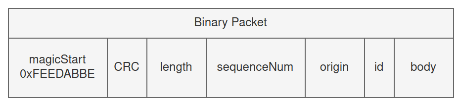
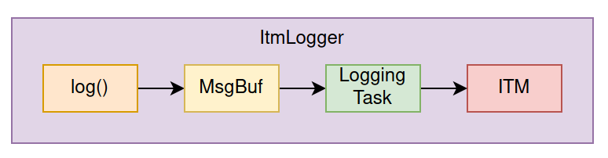
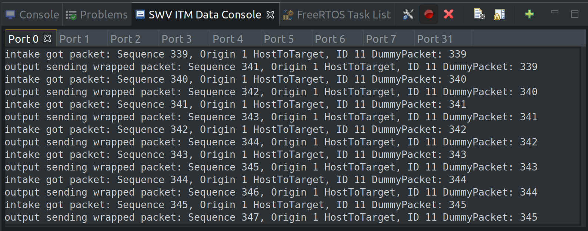
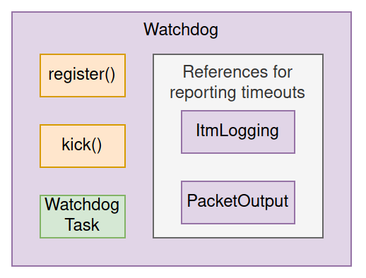
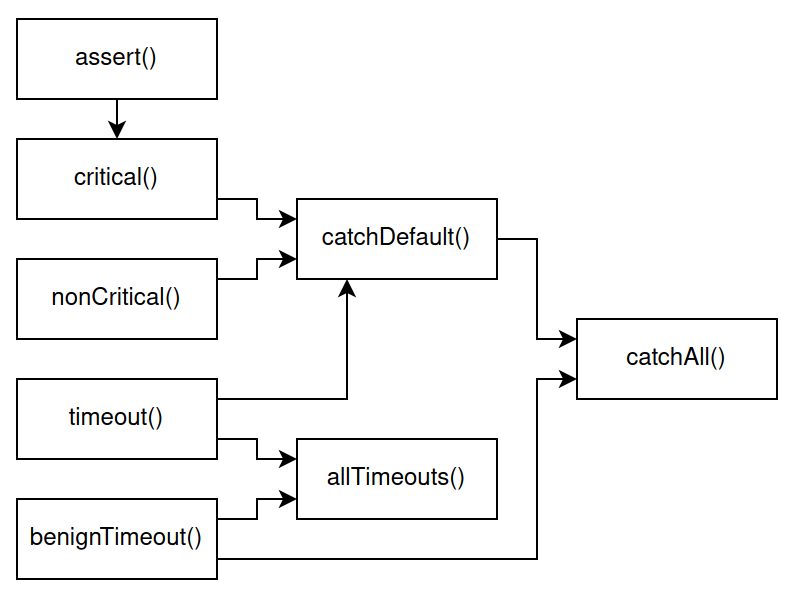
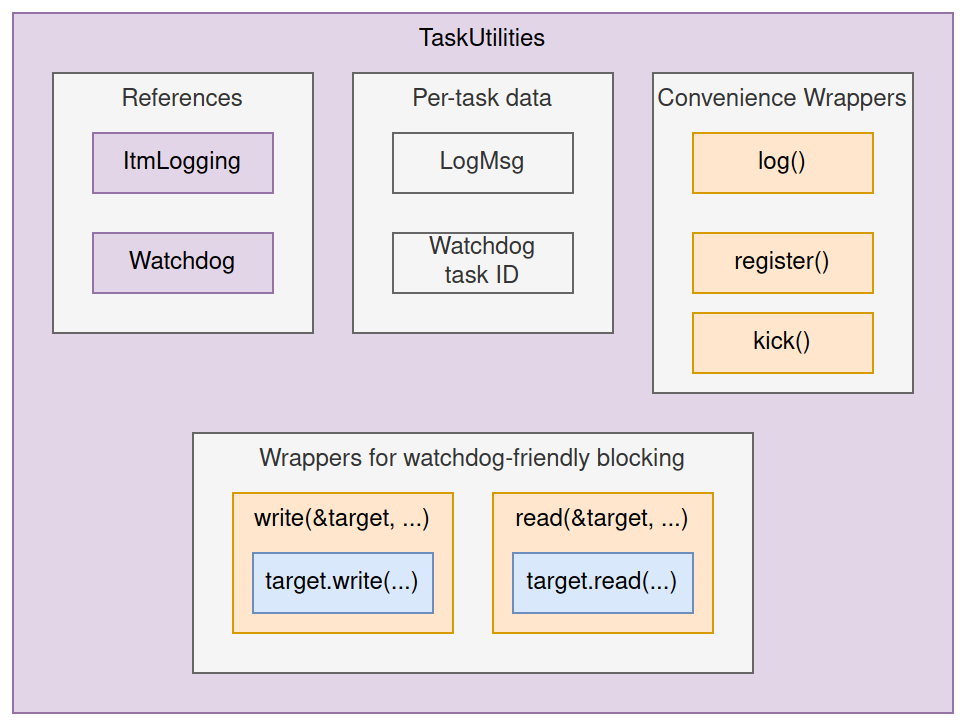

## Overview

This directory contains common code shared across applications.

## Interfaces

Common [interfaces](inc/interfaces.h) (specifically `read()` and `write()`) enable composability among hardware abstractions and some FreeRTOS wrappers.

See the [loopback](../loopback) and [vfd_bench](../vfd_bench) projects for more usage examples of these interfaces.

## Static FreeRTOS Wrappers

The STM32 applications in this repo use FreeRTOS. Most FreeRTOS components allow either dynamic or static allocation, with static allocation offering some additional runtime predictability. Unfortunately, static allocation can be more tedious and error-prone with the existing C-API. C++ wrappers simplify the creation of static components, and offer some additional conveniences.

See [static_rtos.h](inc/static_rtos.h) for what wrappers are currently available. More wrappers may be added as required.

## Hardware Abstractions

High-performance hardware abstractions are available for UART and USB peripherals. These abstractions are DMA-based and built on top of FreeRTOS.

Common interfaces make it easy to substitute peripherals. For example, it is trivial to swap a UART communications link for USB.

See the [loopback](../loopback) project readme for more detailed examples of these abstractions in-use.

## Binary Packets

Data is sent between devices (e.g. microcontrollers and host PC) and between tasks running on each device as binary c-struct packets.

Binary packets all share the following fields:
- `magicStart` - A hardcoded value which improves efficiency of resynchronizing after data corruption.
- `CRC` - The CRC value of all following bytes in the packet.
- `length` - The number of bytes in the packet. This excludes the size of the first two `magicStart` and `CRC` fields. Those two fields are considered part of the "Packet Wrapper" and are only applied to data "on the wire". These fields are not passed around internally.
- `sequenceNum` - An incrementing number assigned to each packet, which is used to check if any packets were dropped.
- `origin` - Describes where the packet was created.
- `id` - Describes which packet to use from the following `body` union field.
- `body` - A union of all packet types. For efficiency, only the bytes used by the particular sub-type are transmitted, rather than always sending bytes for the full union.

The packet definitions ([`packets.h`](inc/packets.h)) and parsing, printing, and packing code ([`packet_utils.cpp`](src/packet_utils.cpp)) are shared across all applications in this repo. This avoids packet definition mismatches between applications running on the host PC and target devices.

To add new a binary packet, edit the following:
- [`PacketID`](inc/packets.h)
- [`Packet`](inc/packets.h)
- [`packetBodySizeFromID`](inc/packets.h)
- [`packetIdToString`](inc/packets.h)
- [`snprintPacket`](src/packet_utils.cpp)

## ITM Logging

Tasks may send printf-style log messages over the ITM interface via the `ItmLogger`. Since this is commonly used by all tasks, it is included as part of [TaskUtilities](#Task-Utilities) for convenience.

To see ITM traces in the IDE you'll need to enable SWV: `Run > Debug Configurations > Debugger > Serial Wire Viewer`, check `Enable`, set `Core Clock` to `96.0`. This needs to match `SYSCLK` in the .ioc clock configuration.

To view ITM traces while debugging, open `Window > Show View > SWV > SWV ITM Data Console`. Click on the wrench icon in this new terminal and check `ITM Stimulus Ports` `31` and `0`. Logs are written to port `0`, but we're using port `31` as a workaround for [this issue](https://community.st.com/s/question/0D53W00000Hx6dxSAB/bug-itm-active-port-ter-defaults-to-port-0-enabled-when-tracing-is-disabled).

Then click the red circle to "Start Trace". Note that this can only be toggled when execution is paused. When tracing is disabled, then the expensive printf formatting operation is skipped.

Counters tracking incoming and outgoing byte and packet totals are also logged over ITM. These can be a helpful sanity check for troubleshooting suspected data loss. See the [`ItmPort` enum](inc/itm_logging.h) for port mapping. Unfortunately, the IDE interface is [not as user-friendly as it could be](https://community.st.com/s/question/0D53W00000Y4DuCSAV/log-numeric-data-in-swv-itm-data-console).

An area of future work is to completely eliminate formatting operations from the target microcontroller. One possibility is to send an ID representing the particular format string, along with the raw arguments to the host for formatting.

Note that [binary packets](#binary-packets) are another high-performance logging option that is currently available, but they're a bit more tedious to introduce than printf log statements for debugging purposes.

## Watchdog

A watchdog task monitors other tasks for unexpected stalls. A maximum of 24 tasks may be monitored, due to the use of FreeRTOS event group for efficiency.

To use this feature, pass the watchdog object to each task you wish to monitor, then call `registerTask()` in each task's entry function, followed by `kick()` for each loop iteration.

If any task is not kicked for 2000 ticks (2 seconds with current project config), then a stall is detected and a watchdog timeout is reported. This timeout report is sent over ITM logging and/or Binary Packet logging, depending on which output options are provided to the watchdog. This watchdog task may be extended to allow a hardware watchdog to reset the device; however, reporting without resetting seems like the most practical way to handle stalls during product prototyping.

See [TaskUtilities](#Task-Utilities) for a more convenient way to use the watchdog.

## Error capture

There are a limited number of hardware breakpoints available on Cortex-M devices. The STM32F4 has 6. In order to conserve the number of breakpoints that are necessary to detect a variety of errors, common error-detection functions in [`catch_errors.cpp`](src/catch_errors.cpp) are aggregated. For example, setting a single breakpoint at `catchDefault()` will break at all critical errors, nonCritical warnings, and non-ideal timeouts.

## Task Utilities

Almost all tasks make use of ITM Logging and Watchdog. Task Utilities wraps this common functionality and adds some additional conveniences:

### ITM Logging

Manages a local `LogMsg` struct per task, which is necessary for high-performance logging.

### Watchdog

Manages a per-task ID necessary for using the watchdog functions. It also provides wrappers for `read()` and `write()` interfaces to allow infinite blocking without triggering watchdog timeouts, while still allowing inspecting stack frames of blocked tasks during debugging. Setting a breakpoint at `allTimeouts()` steps through all blocking tasks.

### Initialization

Rather than passing both a `Watchdog` and `ItmLogger` instance to each task, pass a single `TaskUtilitiesArg` to the task's constructor.