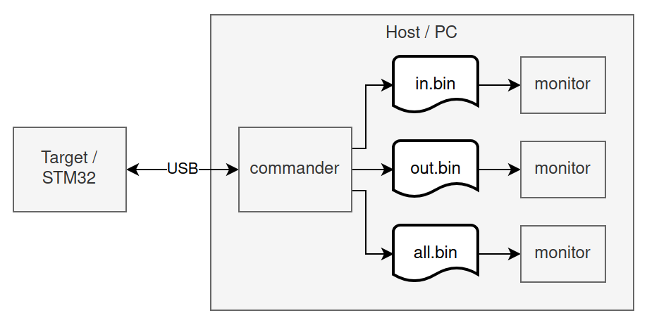
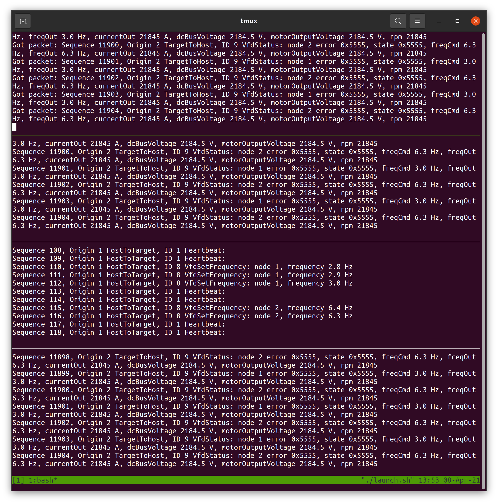

CLI interface to target over serial connection.

- Sends "set frequency" packets for 5 VFDs to target whenever frequency setpoint changes.
- Prints any received packets (or packet parsing errors).
- Sends a heartbeat packet each second.

Keyboard commands:
```
n - next VFD
p - previous VDF
u - "up" - increment VFD frequency
d - "down" - decrement VFD frequency
z - set VFD frequency to zero
<space> - sets all VFD frequencies to zero
q - quit
```

Generates auditable logfiles for live inspection and replay with `monitor` app.

Logfile output:
- `in.bin`
  - Copy of incoming serial data (from target)
- `out.bin`
  - Copy of outgoing serial data (to target)
- `all.bin`
  - Both incoming and outgoing packets
  - Errors in incoming stream are replaced with packets indicating errors
  - Intended to be consumed and displayed by `monitor` app so `commander` app's UI isn't cluttered with displaying all traffic.



Launch with:
```
make
./commander
```

Launch everything:
```
tmux
./launch.sh
```
Quit by pressing `q` (exits `commander`), then `ctrl+c` three times (closes each `monitor`).



Note that the above screenshot is using the "Fake VFD" which provides dummy values (0x5555 / 21845) for many of status values. The target is also configured to only manage two VFDs rather than all five for this test, which is why telemetry data packets for only nodes 1 and 2 are printed.

To monitor for particular errors in yet another terminal:
```
tail -c +1 -f in.bin | stdbuf -oL ../monitor/monitor | grep 'Error: node 2'
```
