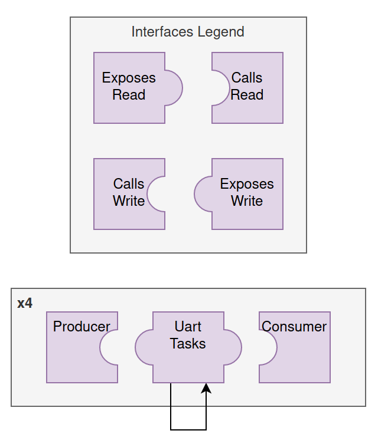

## Loopback

A collection of loopback tests to ensure we can achieve maximum data rates over USB and any number of UART peripherals with zero packet loss and low CPU usage.

Enable a particular test by uncommenting one of the following in `loopback/custom/src/mainCpp.cpp`:
```cpp
//#define TEST_UART_THROUGHPUT
//#define TEST_USB_IO
//#define TEST_USB_LOOPBACK
//#define TEST_USB_PACKET_PARSING
//#define TEST_USB_SINGLE_UART_LOOPBACK
//#define TEST_USB_ALL_UART_LOOPBACK
```

#### TEST_UART_THROUGHPUT

Configures a producer / consumer pair of tasks for each UART.
The producers generate packets.
The consumers parse packets and print diagnostic info (losses, etc.) to ITM logs.
This assumes all UARTs are hardwired as loopback, but it's also okay to hardwire different UARTs to each other (see [TEST_USB_ALL_UART_LOOPBACK](#TEST_USB_ALL_UART_LOOPBACK) for an example of cross-wiring).


The above diagram may also be represented from an interfaces perspective:



The following diagrams will show both representations.

#### TEST_USB_IO

Tests usb input / output.
The producer task outputs periodic messages that you can inspect on your PC's serial monitor.
The consumer task prints any messages sent to the uC in the ITM log (as hex).


#### TEST_USB_LOOPBACK

Test internal USB loopback.
Anything written to usb will be echoed back.
Can reach 300 KBps (25x faster than 115200 UART baud rate), but USB task will then consume 70% CPU.


#### TEST_USB_PACKET_PARSING

Tests binary packet parsing and repacking over USB.

Use either of these apps to generate valid packets:
- [throughput](../testApps/throughput)
- [commander](../testApps/commander)

You may also just send random data over a serial connection (e.g. `minicom`, `putty`, `screen`, etc.), and watch the ITM logs for parsing errors.


#### TEST_USB_SINGLE_UART_LOOPBACK

Pass USB data through UART. This assumes UART 5 is hardwired to itself.


#### TEST_USB_ALL_UART_LOOPBACK

Setup a big chain of all UARTs plus USB.
Any data written to USB will be echoed back (after passing through all UARTs).
This assumes the following hardwired connections:
- uart7 connected to uart9.
- uart4 and and uart5 are connected to themselves.

At theoretical maximum of 11.52 KBps (@ 115200 baud with start and stop bits), consumes less than 8% of available CPU across 15 tasks.


Corresponding output from [USB packet generator test app](../testApps/throughput):
```
Sent 8065 packets
Got 8032 packets (last id 8031). Dropped 0. Pending 34. Bps total 11474, in interval 10400
Sent 8079 packets
Got 8044 packets (last id 8043). Dropped 0. Pending 36. Bps total 11470, in interval 9600
Sent 8094 packets
Got 8064 packets (last id 8063). Dropped 0. Pending 31. Bps total 11478, in interval 16000
Sent 8108 packets
Got 8076 packets (last id 8075). Dropped 0. Pending 33. Bps total 11475, in interval 9600
Sent 8123 packets
Got 8089 packets (last id 8088). Dropped 0. Pending 35. Bps total 11473, in interval 10400
Sent 8137 packets
Got 8102 packets (last id 8101). Dropped 0. Pending 36. Bps total 11471, in interval 10400
Sent 8151 packets
Got 8121 packets (last id 8120). Dropped 0. Pending 31. Bps total 11478, in interval 15200
Sent 8166 packets
Got 8134 packets (last id 8133). Dropped 0. Pending 33. Bps total 11476, in interval 10400
```
