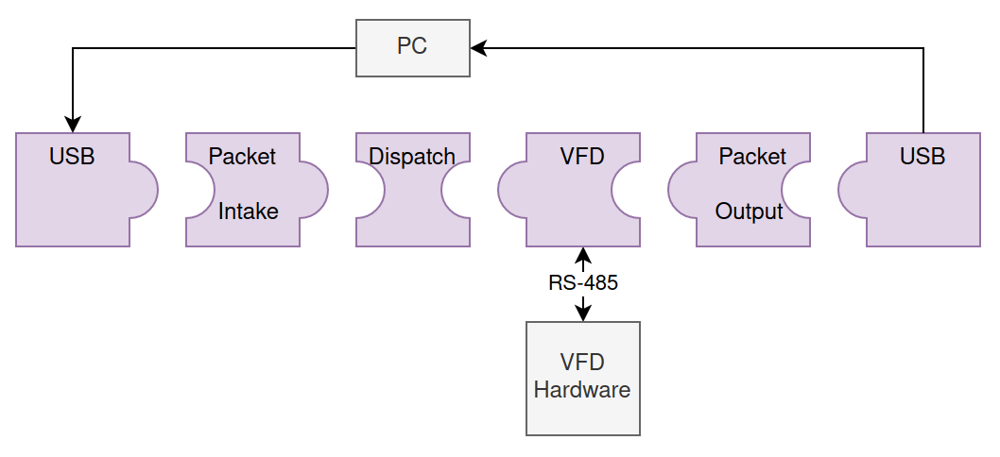
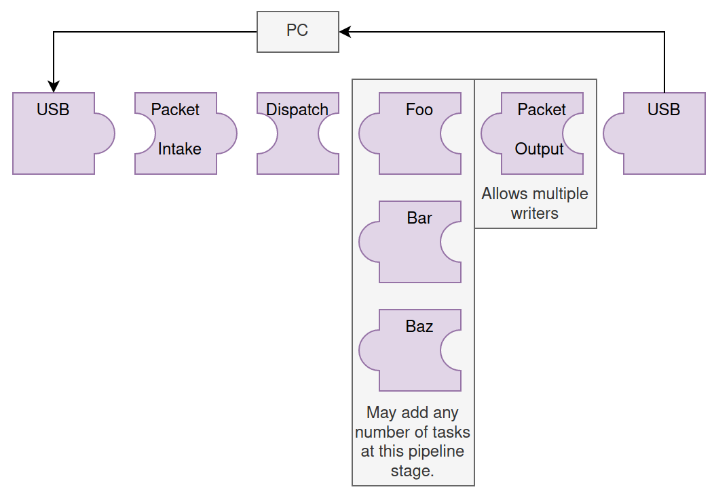
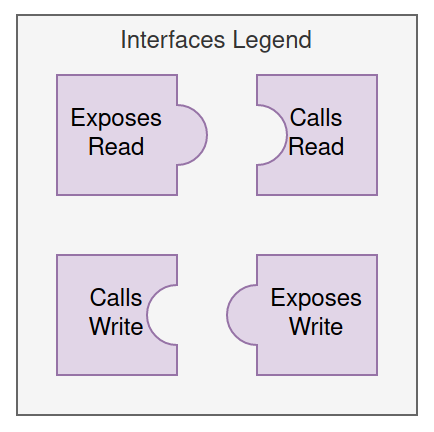
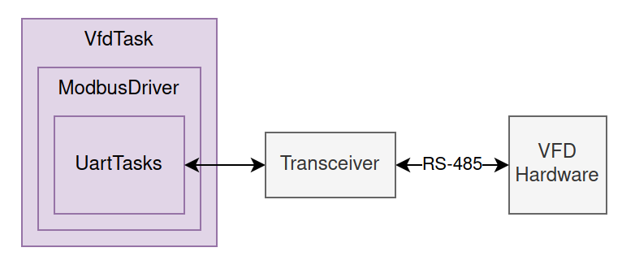
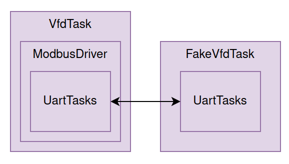

This project demonstrates an architecture for controlling one or more tasks from a host device by sending binary packets over a serial link. In this case, packets are sent from a PC over USB. It's easy to modify this for other communication schemes, such as between multiple microcontrollers over UART - simply swap the USB object passed to Packet Intake / Output with a UART object.

The notable task in this project is the `VfdTask`, which communicates with multiple [Automation Direct GS3 Variable-Frequency Drives](https://cdn.automationdirect.com/static/manuals/gs3m/gs3m.pdf) (VFDs) over a common RS-485 modbus connection.

The [commander](../host_apps/commander) application running on the host PC provides a CLI for controlling frequency setpoints (P.16) and displaying VFD statuses (registers 48449 through 48456).

If using this project as a template for other work, functionality may be modified by replacing the VFD task with other tasks. Just be sure to update the dispatcher task to route packets to the appropriate tasks.

Here's a refresher on how interfaces are represented in the above diagrams.

More examples can be found in the [loopback](../loopback) project. Some additional relevant documentation can be found in the [common](../common) and [host_apps](../host_apps) directories.

The VFD task contains a `ModbusDriver`, which contains the `UartTasks` necessary for communication with the VFD hardware over RS-485.

In order to monitor for signal quality issues on the differential bus (such as shorts and collisions), the Rx pins on the RS-485 transceiver (external hardware) may be configured to always listen for data on the bus, even when transmitting. In this configuration, the Tx data will be received as an Rx "echo", and will be checked for consistency if `MODBUS_REQUEST_ECHOING_ENABLED` is defined.

This project also allows using an internal task to emulate the VFD and RS-485 transceiver. If `USE_FAKE_VFD` is defined, then a `FakeVfdTask` will be launched. The echoing behavior of this fake RS-485 transceiver will match the status of `MODBUS_REQUEST_ECHOING_ENABLED`. The current configuration uses UART port 8 for the main VFD controller task and UART port 9 for the fake VFD task, so these ports must be wired together for testing; however, this is may be reconfigured to use other ports.

## Timing

The VFD hardware has an optional timeout feature which can halt the device if it does not receive any commands within a specified period. This project is compatible with the strictest timeout period of 100ms, even while managing 5 VFDs. The following tables show the timing requirements of the modbus operations used.

### Setpoint update:

|  |  |
| - | - |
| 2.3 ms | Send 8 characters (11 * 8 symbols)
| 5.0 ms | Wait for VFD
| 2.3 ms | Receive 8 characters
| 1.0 ms | Inter-message delay (3.5 characters)
| **10.6 ms** | Total

### Status request (read 8 consecutive values):

|  |  |
| - | - |
| 2.3 ms | Send 8 characters
| 5.0 ms | Wait for VFD
| 6.0 ms | Receive 21 characters (5 overhead + 16 (8 * 2-character words)
| 1.0 ms | Inter-message delay (3.5 characters)
| **14.3 ms** | Total

### Most forgiving timeout scenario - All setpoints:

|  |  |
| - | - |
| 53 ms | Send setpoint updates (10.6 ms) to all 5 VFDs
| **47 ms** | Headroom

### Least forgiving timeout scenario - All status requests:

|  |  |
| - | - |
| 71.5 ms | Request status (14.3 ms) from all 5 VFDs
| **28.5 ms** | Headroom